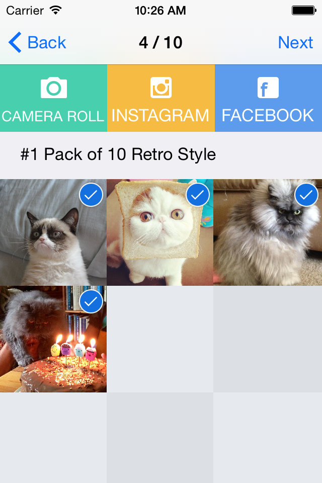

Enable Facebook & Instagram Photo Selection
==============

The Kite Print SDK includes optional functionality that allows your users to add photos from Instagram, Facebook or Both in addition to just the Camera Roll.



_If you haven't already, see the [README](../../README.md) for an initial overview and instructions for adding the SDK to your project._

Overview
--------
1. Update your CocoaPods Podfile with the desired dependencies
2. Configure Instagram
3. Configure Facebook

Sample Code
-----------
1. Add the following lines to your CocoaPods Podfile and run `pod update`
```ruby
pod "Kite-Print-SDK/Instagram" # only needed if you want Instagram
pod "Kite-Print-SDK/Facebook" # only needed if you want Facebook
```
2. If you've added an Instagram Podfile dependency then the next step is to enable Instagram functionality in code. Firstly navigate over to [https://instagram.com/developer/](https://instagram.com/developer/) and register your Instagram client app (if you don't already have one). You'll need the `Client ID`, `Client Secret` & `Redirect URI`. Next using these details enable Instagram for the Kite SDK:

    ```obj-c
    [OLKitePrintSDK setInstagramEnabledWithClientID:@"YOUR CLIENT ID" secret:@"YOUR CLIENT SECRET" redirectURI:@"YOUR REDIRECT URL"];
    ```
That's all there is to do -- an Instagram button should now appear on photo selection screens.
3. If you've added a Facebook Podfile dependency then the next step is to complete Facebook SDK Integration. Instructions on how to do this can be found here [https://developers.facebook.com/docs/ios/getting-started/](https://developers.facebook.com/docs/ios/getting-started/). At a high level this involves:

    1. Creating and configuring a Facebook App
    2. Configuring your iOS Apps `.plist`
    3. Handle Facebook responses in `application:openURL:sourceApplication:annotation:` and `application:didFinishLaunchingWithOptions:launchOptions`
    For example:
    ```
    - (BOOL)application:(UIApplication *)application didFinishLaunchingWithOptions:(NSDictionary *)launchOptions {
    return [[FBSDKApplicationDelegate sharedInstance] application:application didFinishLaunchingWithOptions:launchOptions];
    }
- (BOOL)application:(UIApplication *)application openURL:(NSURL *)url sourceApplication:(NSString *)sourceApplication annotation:(id)annotation {
    return [[FBSDKApplicationDelegate sharedInstance] application:application openURL:url sourceApplication:sourceApplication annotation:annotation];
}
    ```

4. Xcode 7 includes some new security features. In order to connect to the social services above you will need to add some more exceptions to your project's info plist file (in addition to the ones that Kite requires).
We need to add forward secrecy exceptions for Facebook's and Instagram's CDNs. The following is what you need to copy your app's info plist, which includes anything that is needed by Kite as well:
```
<key>LSApplicationQueriesSchemes</key>
	<array>
		<string>fbauth2</string>
		<string>org-appextension-feature-password-management</string>
		<string>fbapi</string>
		<string>fb-messenger-api</string>
		<string>fbshareextension</string>
	</array>
	<key>NSAppTransportSecurity</key>
	<dict>
		<key>NSExceptionDomains</key>
		<dict>
			<key>akamaihd.net</key>
			<dict>
				<key>NSExceptionRequiresForwardSecrecy</key>
				<false/>
				<key>NSIncludesSubdomains</key>
				<true/>
			</dict>
			<key>facebook.net</key>
			<dict>
				<key>NSExceptionRequiresForwardSecrecy</key>
				<false/>
				<key>NSIncludesSubdomains</key>
				<true/>
			</dict>
			<key>facebook.com</key>
			<dict>
				<key>NSExceptionRequiresForwardSecrecy</key>
				<false/>
				<key>NSIncludesSubdomains</key>
				<true/>
			</dict>
			<key>instagram.com</key>
			<dict>
				<key>NSExceptionRequiresForwardSecrecy</key>
				<false/>
				<key>NSIncludesSubdomains</key>
				<true/>
			</dict>
			<key>fbcdn.net</key>
			<dict>
				<key>NSExceptionRequiresForwardSecrecy</key>
				<false/>
				<key>NSIncludesSubdomains</key>
				<true/>
			</dict>
			<key>cdninstagram.com</key>
			<dict>
				<key>NSExceptionRequiresForwardSecrecy</key>
				<false/>
				<key>NSIncludesSubdomains</key>
				<true/>
			</dict>
			<key>amazonaws.com</key>
			<dict>
				<key>NSExceptionRequiresForwardSecrecy</key>
				<false/>
				<key>NSIncludesSubdomains</key>
				<true/>
			</dict>
		</dict>
	</dict>
```
