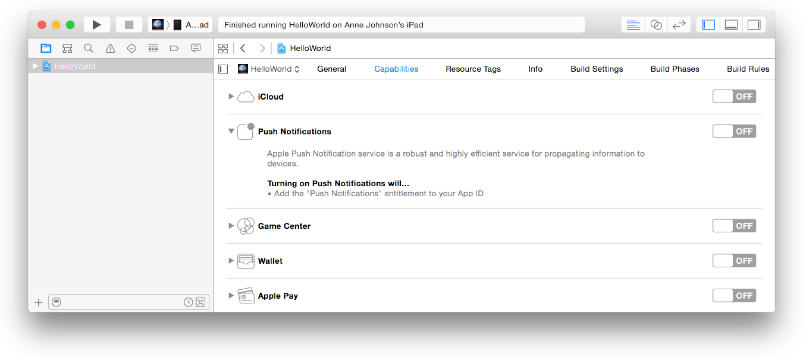
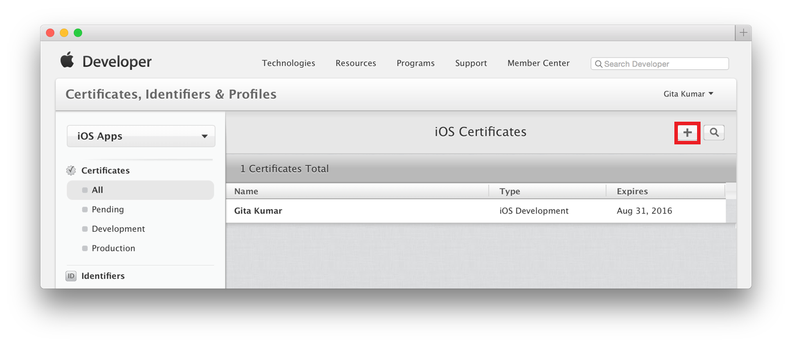
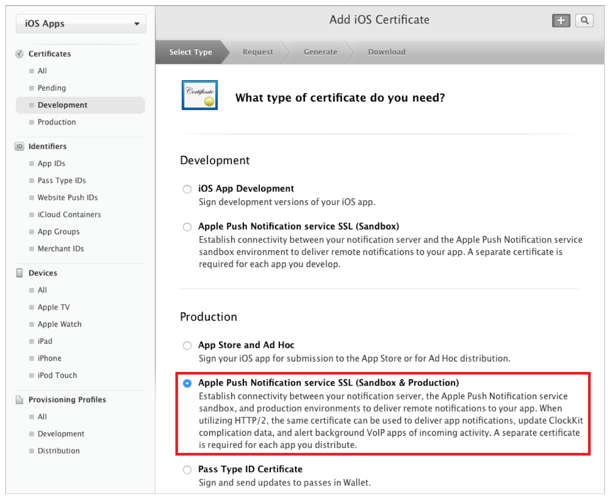
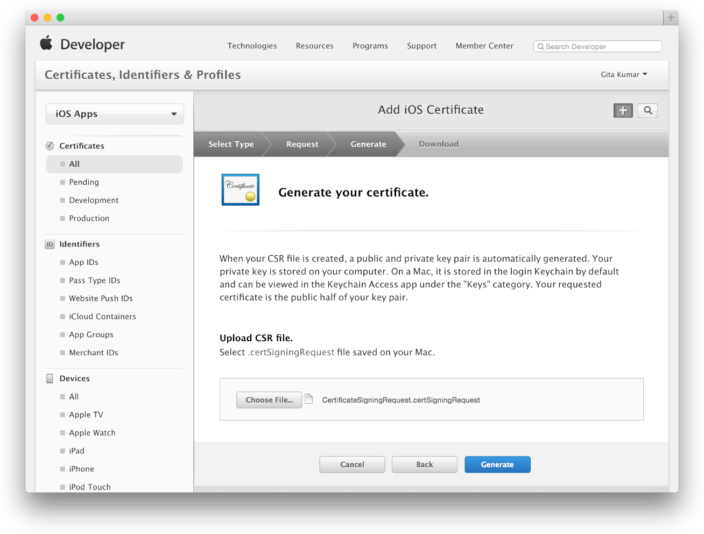

Configuring Push Notifications
==============

Push notifications are a powerful marketing tool that if used effectively can increase both user engagement and customer life time value by driving more sales within your application. Kite supports sending push notifications to your customers with a bit of configuration.

Prerequisites
--------
1. [Create a print order](create_print_order.md) representing the product(s) you wish to have printed and posted
2. [Set the shipping address](shipping.md) to which the order will be delivered

Enabling Push Notifications
--------
First enable push notifications in your Xcode project. In the Capabilities pane, if Push Notifications isn’t enabled, click the switch in the Push Notifications section.



Creating a Universal Push Notification Client SSL Certificate
--------

We need to generate a push notification client SSL certificate that will allow us to send push notifications.

To generate a universal client SSL certificate:

1. Go to the [Certificates, Identifiers & Profiles](http://developer.apple.com/account) section of the iOS Developer Member Center, select Certificates.
2. Click the Add button (+) in the upper-right corner.

    

3. Under Production, select the “Apple Push Notification service SSL (Sandbox & Production)” checkbox, and click Continue.
    
    
    
4. Choose an App ID from the App ID pop-up menu, and click Continue. Choose the explicit App ID that matches your bundle ID.
5. Follow the instructions on the next webpage to create a certificate request on your Mac, and click Continue.
6. Click Choose File.
7. In the dialog that appears, select the certificate request file (with a .certSigningRequest extension), and click Choose.
8. Click Generate.
    
9. Download the certificate and double-click the file to add the credentials to Keychain Access. 
10. Click Done. 

Installing a Client SSL Signing Identity on Kite
--------

Next we need to export the signing identity from the keychain and upload it to Kite.

To export a client SSL signing identity:

1. Launch Keychain Access.
2. Find the certificate you want to export and disclose its contents. You’ll see both a certificate and a private key.
3. Select both the certificate and the key, and choose File > Export Items.
4. From the File Format pop-up menu, choose the *.p12 extension*
5. Enter a filename in the Save As field, and click Save. Save the .p12 file without a password.
6. Upload the saved .p12 file to Kite in the [Notification Settings](https://www.kite.ly/settings/notifications) section of the dashboard

[](https://vimeo.com/156704579)


Updating your app to send Push Notifications
--------
Finally we need to tell our app to register for remote notifications:

1. Register for remote notifications, be sure to set your Kite API Key & Environment first.

 
   ```obj-c
    - (BOOL)application:(UIApplication *)application didFinishLaunchingWithOptions:(NSDictionary *)launchOptions {
        [OLKitePrintSDK setAPIKey:@"YOUR_LIVE_API_KEY" withEnvironment:kOLKitePrintSDKEnvironmentLive];
        NSUInteger types = (UIUserNotificationTypeSound | UIUserNotificationTypeAlert | UIUserNotificationTypeBadge);
        [[UIApplication sharedApplication] registerUserNotificationSettings:[UIUserNotificationSettings settingsForTypes:types categories:nil]];
        [[UIApplication sharedApplication] registerForRemoteNotifications];
    
        return YES;
    }
    ```


Sending your first notification
--------


